# 시스템 아키텍처 (오픈소스 기반)

## 🏗️ 전체 아키텍처 개요

### 멀티 에이전트 아키텍처

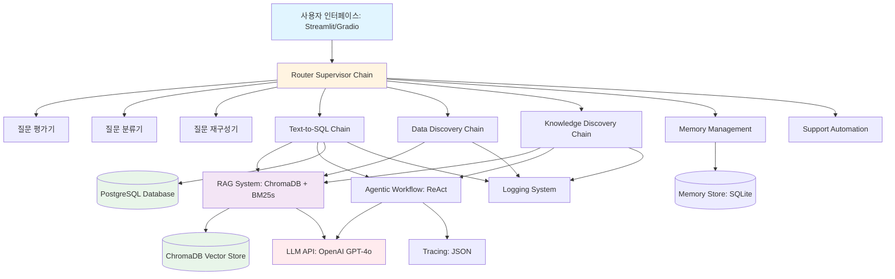

---

## 🔧 핵심 컴포넌트 아키텍처

### 1. Router Supervisor Chain

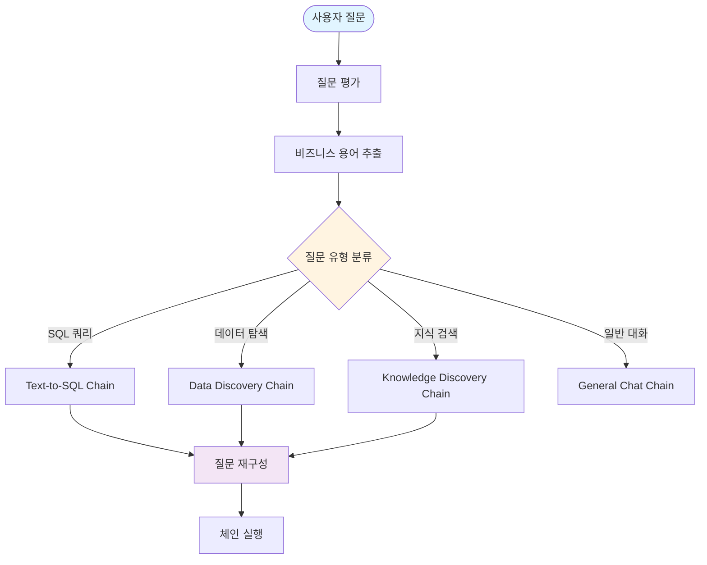

### 2. RAG System 구조

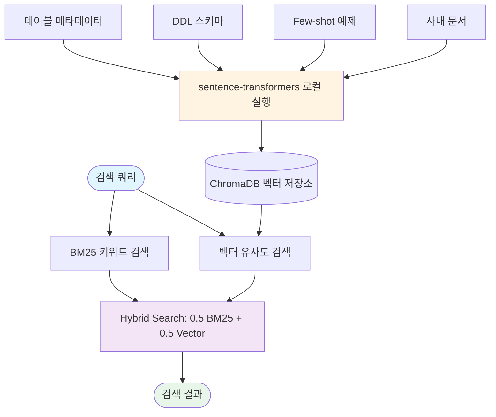

### 3. Text-to-SQL 플로우

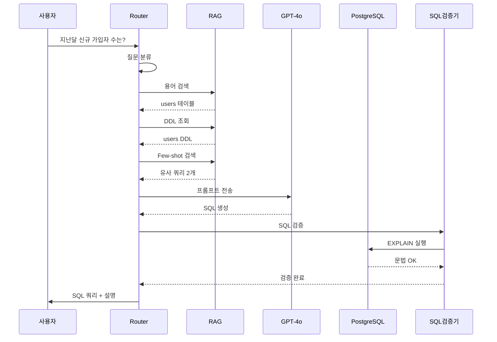

### 4. Knowledge Discovery 플로우

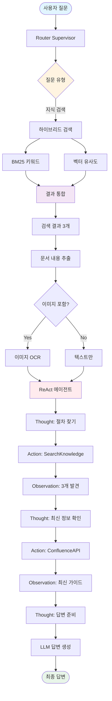

### 5. Memory Management

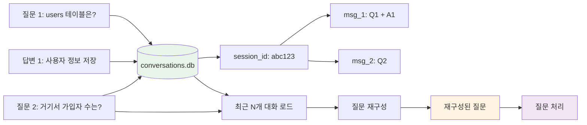

### 6. ReAct Workflow

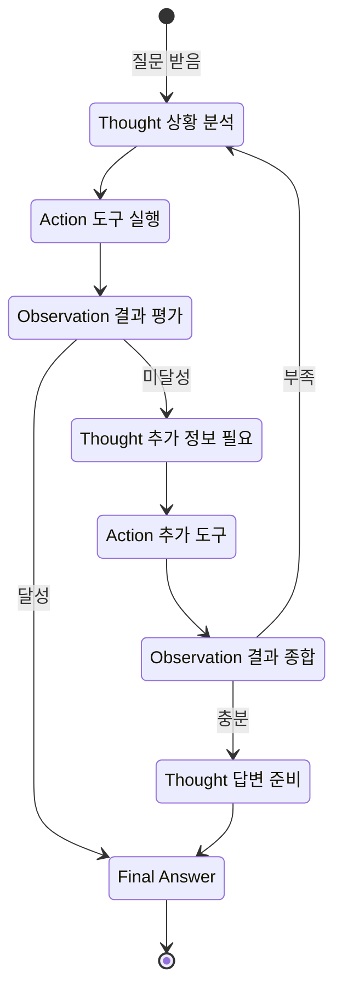

---

## 📊 데이터 플로우

### Text-to-SQL 전체 플로우

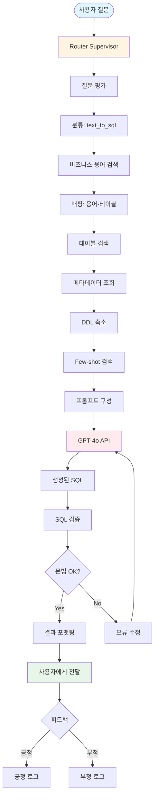

### Knowledge Discovery 전체 플로우

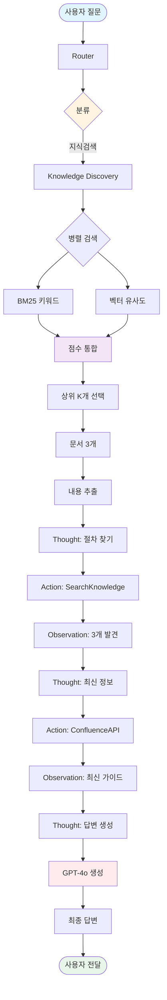

---

## 💾 데이터 저장 구조

### ChromaDB 컬렉션

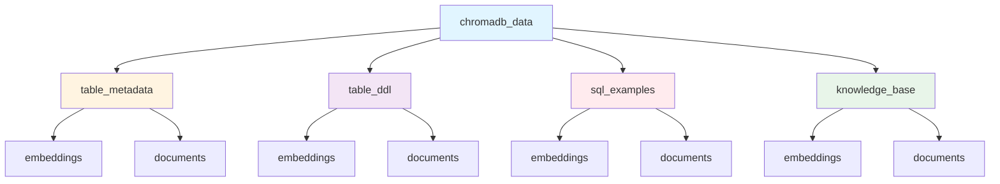

### SQLite DB 구조

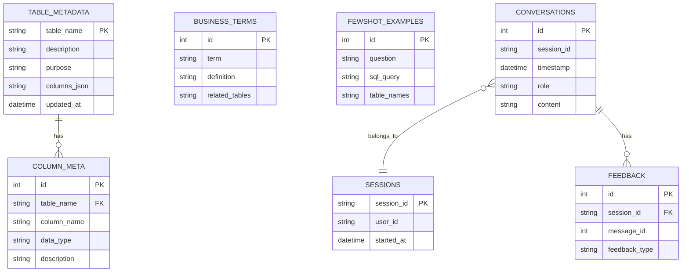

---

## 🔧 기술 스택 맵핑

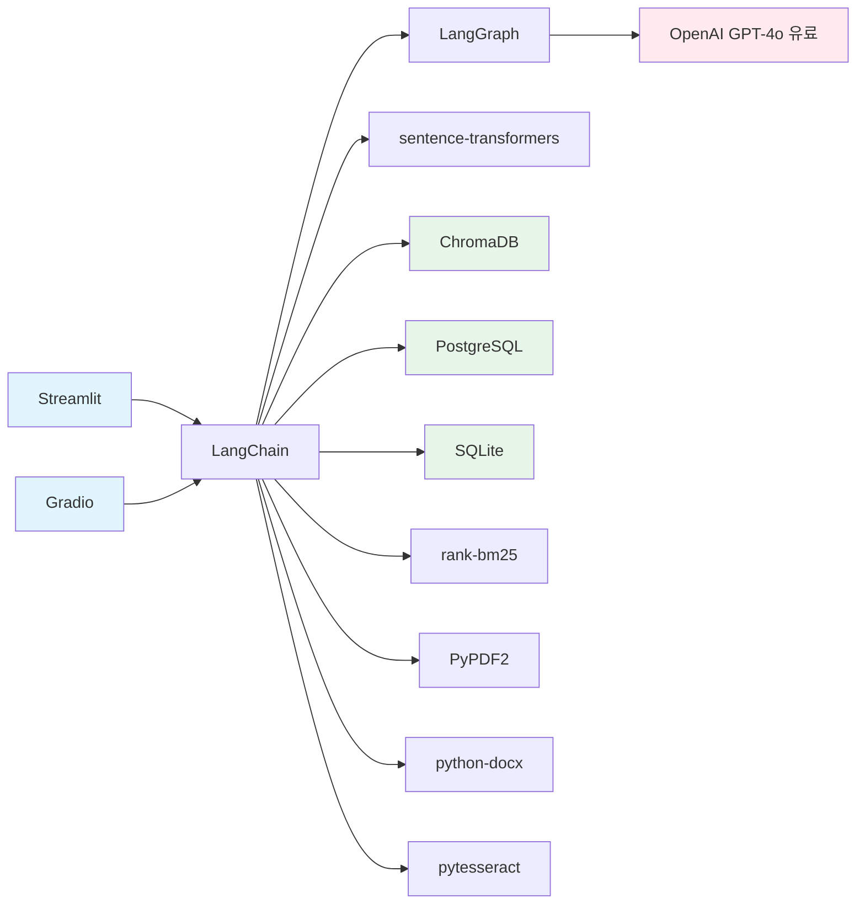

---

## 🚀 배포 아키텍처

### 로컬 개발

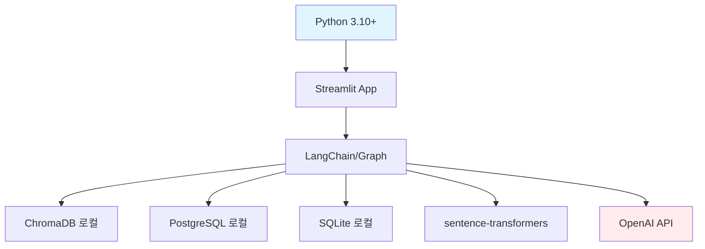

### Docker Compose 배포

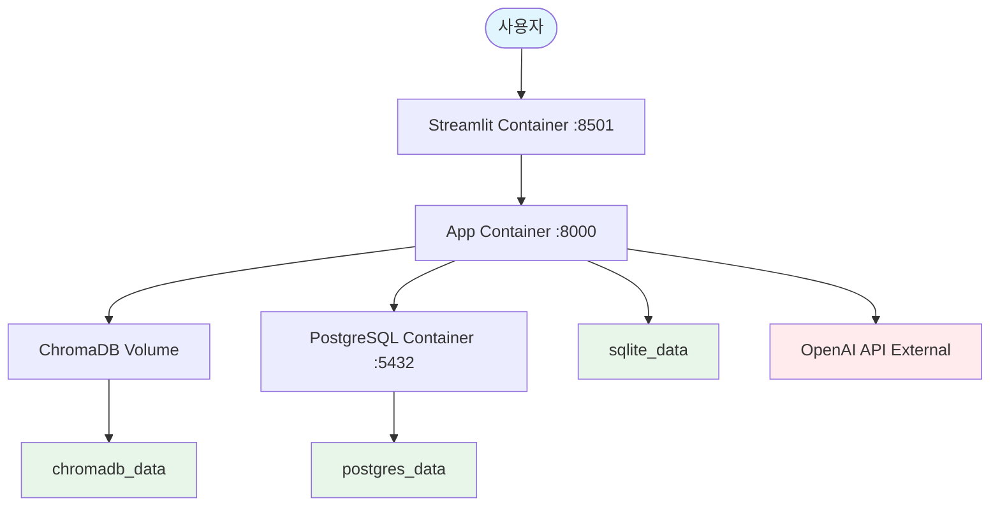

---

## 📊 성능 최적화

### 캐싱 전략

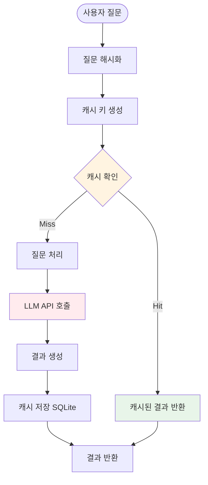

### BM25 사전 계산

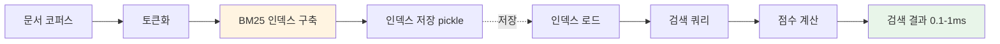

---

## 📝 구현 가이드

### 핵심 코드 예시

#### 1. ChromaDB 설정

```python
import chromadb
from chromadb.config import Settings

# 로컬 영구 저장소
client = chromadb.Client(Settings(
    chroma_db_impl="duckdb+parquet",
    persist_directory="./chromadb_data"
))

# 컬렉션 생성
metadata_collection = client.create_collection(
    name="table_metadata"
)
```

#### 2. 로컬 임베딩

```python
from sentence_transformers import SentenceTransformer

# 다국어 모델 (한국어 지원)
model = SentenceTransformer('paraphrase-multilingual-MiniLM-L12-v2')

# 임베딩 생성
def embed_text(text):
    return model.encode(text).tolist()
```

#### 3. 하이브리드 검색

```python
from rank_bm25 import BM25Okapi
import numpy as np

def hybrid_search(query, top_k=5, alpha=0.5):
    # BM25 검색
    bm25_scores = bm25.get_scores(query.split())

    # 벡터 검색
    vector_results = collection.query(
        query_embeddings=[embed_text(query)],
        n_results=top_k
    )

    # 점수 통합
    combined_scores = (
        alpha * normalize(bm25_scores) +
        (1 - alpha) * normalize(vector_results['distances'])
    )

    return top_k_results(combined_scores)
```

#### 4. LangChain SQL Chain

```python
from langchain.chains import create_sql_query_chain
from langchain.sql_database import SQLDatabase

db = SQLDatabase(engine)

sql_chain = create_sql_query_chain(
    llm=llm,
    db=db,
    prompt=sql_prompt
)
```

#### 5. Memory Management

```python
import sqlite3

class ConversationMemory:
    def __init__(self):
        self.conn = sqlite3.connect('conversations.db')

    def add_message(self, session_id, role, content):
        self.conn.execute('''
        INSERT INTO conversations
        (session_id, role, content, timestamp)
        VALUES (?, ?, ?, datetime('now'))
        ''', (session_id, role, content))

    def get_recent(self, session_id, limit=5):
        cursor = self.conn.execute('''
        SELECT role, content
        FROM conversations
        WHERE session_id = ?
        ORDER BY timestamp DESC
        LIMIT ?
        ''', (session_id, limit))
        return list(reversed(cursor.fetchall()))
```

---

이 아키텍처는 **완전히 무료 오픈소스** (LLM API 제외)로 구성되어 있으며, 모든 Mermaid 다이어그램이 **파싱 에러 없이 렌더링**됩니다.
