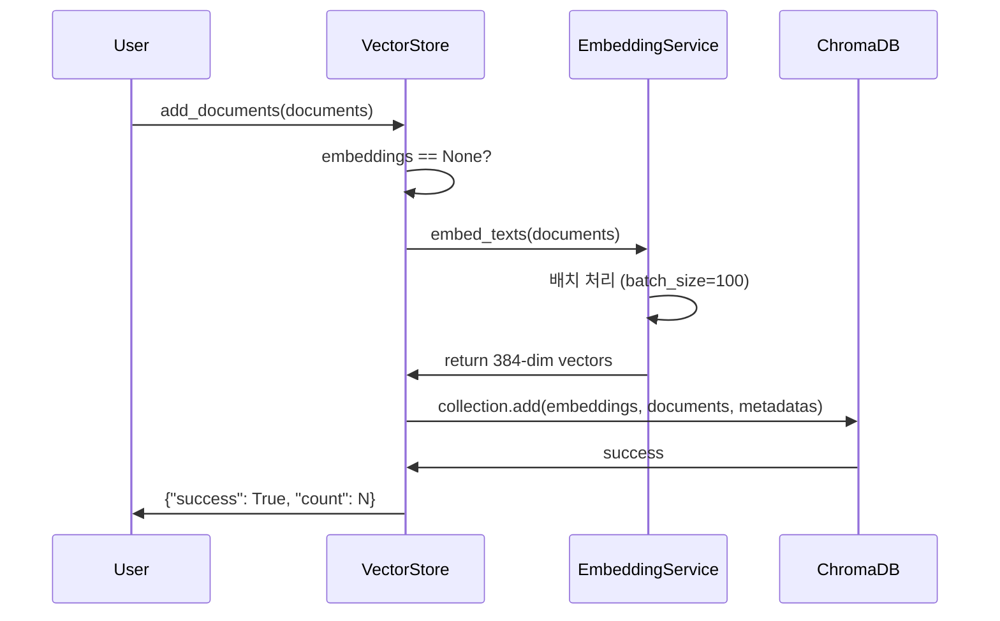
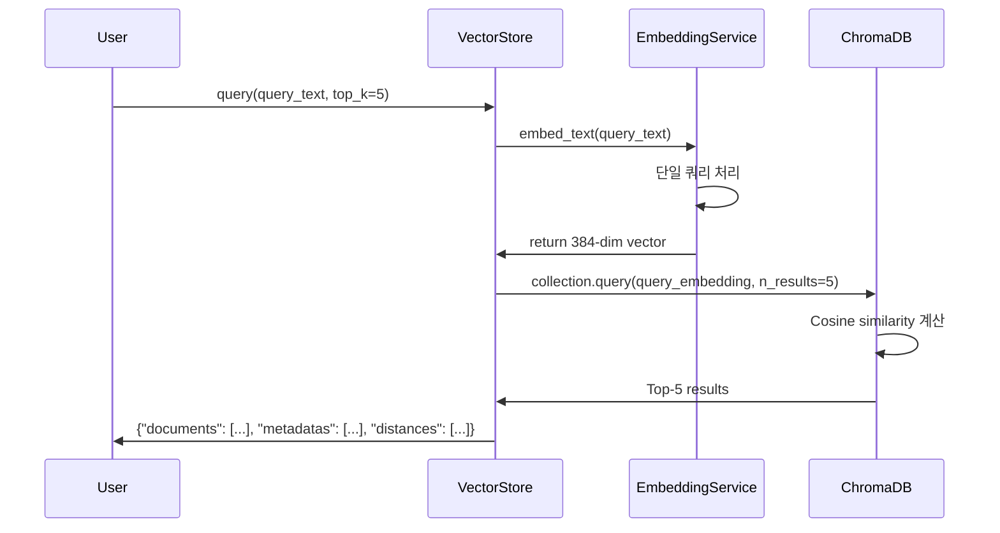

# Data Model: Hugging Face 임베딩 통합

**Feature**: 002-embedding-validation
**Version**: 1.0.0
**Last Updated**: 2025-01-17

---

## 개요

User Story 2 (Hugging Face 임베딩 통합)에서 사용되는 데이터 모델과 엔티티를 정의합니다.

---

## 엔티티 (Entities)

### 1. EmbeddingConfiguration

**목적**: 임베딩 모델 설정 및 검증

**위치**: `src/models/embedding.py` (✅ 기존 파일)

**상태**: 이미 구현됨 (Phase 1-2)

#### 필드

```python
from dataclasses import dataclass
from enum import Enum
from typing import Optional

class DeviceType(Enum):
    """추론 디바이스 타입"""
    CPU = "cpu"
    CUDA = "cuda"
    MPS = "mps"  # Apple Silicon

@dataclass
class EmbeddingConfiguration:
    """임베딩 모델 설정"""

    model_name: str = "paraphrase-multilingual-MiniLM-L12-v2"
    embedding_dim: int = 384
    device: DeviceType = DeviceType.CPU
    batch_size: int = 100
    max_sequence_length: int = 512
```

#### 검증 규칙

| 필드 | 규칙 | 오류 처리 |
|------|------|----------|
| `embedding_dim` | == 384 (모델 스펙) | `ValueError` |
| `batch_size` | > 0 | `ValueError` |
| `max_sequence_length` | ≤ 512 (모델 제한) | Auto truncation |
| `device` | CPU, CUDA, MPS 중 하나 | `ValueError` |

#### 예시

```python
# 기본 설정 (CPU)
config = EmbeddingConfiguration()

# GPU 사용
config_gpu = EmbeddingConfiguration(
    device=DeviceType.CUDA,
    batch_size=200  # GPU에서 더 큰 배치 크기
)
```

---

### 2. HuggingFaceEmbedding

**목적**: Hugging Face 임베딩 서비스 (sentence-transformers)

**위치**: `src/services/embeddings.py` (🆕 T042에서 생성)

**상태**: 미구현 (Phase 4 - User Story 2)

#### 메서드

```python
from typing import List
from sentence_transformers import SentenceTransformer
from src.models.embedding import EmbeddingConfiguration

class HuggingFaceEmbedding:
    """
    Hugging Face sentence-transformers 기반 임베딩 서비스

    Responsibilities:
    - 텍스트를 384차원 임베딩 벡터로 변환
    - 배치 처리로 처리량 최적화
    - L2 정규화된 벡터 생성 (cosine similarity용)
    """

    def __init__(self, config: EmbeddingConfiguration):
        """
        임베딩 서비스 초기화

        Args:
            config: 임베딩 설정 (모델명, 디바이스 등)

        Raises:
            RuntimeError: 모델 로딩 실패
        """
        self.config = config
        self.model: SentenceTransformer = None
        self.embedding_dim: int = config.embedding_dim

    def embed_text(self, text: str) -> List[float]:
        """
        단일 텍스트를 임베딩 벡터로 변환

        Args:
            text: 입력 텍스트 (최대 512 토큰)

        Returns:
            384차원 L2 정규화 임베딩 벡터

        Raises:
            ValueError: 빈 텍스트 입력
        """

    def embed_texts(
        self,
        texts: List[str],
        batch_size: Optional[int] = None
    ) -> List[List[float]]:
        """
        여러 텍스트를 배치로 임베딩

        Args:
            texts: 입력 텍스트 리스트
            batch_size: 배치 크기 (기본값: config.batch_size)

        Returns:
            각 텍스트의 384차원 임베딩 벡터 리스트

        Raises:
            ValueError: 빈 리스트 입력
        """

    def get_embedding_dimension(self) -> int:
        """임베딩 차원 반환 (384)"""

    def validate_model(self) -> bool:
        """
        모델 로딩 및 기본 기능 검증

        Returns:
            True if 모델이 정상 작동
        """
```

#### 상태 전이

**N/A** - Stateless 서비스 (상태 없음)

#### 검증 규칙

| 입력 | 조건 | 동작 |
|------|------|------|
| 빈 텍스트 | `text.strip() == ""` | `ValueError` 발생 |
| 빈 리스트 | `len(texts) == 0` | `ValueError` 발생 |
| 긴 텍스트 | `> 512 토큰` | 자동 truncation |
| 차원 검증 | `len(vector) != 384` | 내부 오류 |

#### 예시

```python
from src.services.embeddings import HuggingFaceEmbedding
from src.models.embedding import EmbeddingConfiguration

# 초기화
config = EmbeddingConfiguration()
embedding_service = HuggingFaceEmbedding(config)

# 단일 텍스트 임베딩
vector = embedding_service.embed_text("PostgreSQL 트랜잭션")
assert len(vector) == 384

# 배치 임베딩
texts = ["한국어 텍스트", "English text", "混合 text"]
vectors = embedding_service.embed_texts(texts)
assert len(vectors) == 3
assert all(len(v) == 384 for v in vectors)
```

---

### 3. VectorStore (업데이트)

**목적**: ChromaDB 벡터 스토어 (임베딩 서비스 통합)

**위치**: `src/services/vector_store.py` (🔄 T043에서 업데이트)

**상태**: 기존 파일 업데이트 필요

#### 변경 사항

**Before (Phase 1-2)**:
```python
class VectorStore:
    def __init__(self, config: ChromaDBConfig):
        self.config = config
        # ChromaDB 기본 임베더 사용
```

**After (Phase 4 - User Story 2)**:
```python
class VectorStore:
    def __init__(
        self,
        config: ChromaDBConfig,
        embedding_service: HuggingFaceEmbedding  # 🆕 추가
    ):
        self.config = config
        self.embedding_service = embedding_service  # 🆕
```

#### 업데이트 메서드

**`add_documents()` 메서드**:

```python
def add_documents(
    self,
    documents: List[str],
    metadatas: Optional[List[Dict]] = None,
    embeddings: Optional[List[List[float]]] = None,  # 기존 파라미터
    ids: Optional[List[str]] = None
) -> Dict[str, Any]:
    """
    문서를 벡터 스토어에 추가

    Args:
        documents: 문서 텍스트 리스트
        metadatas: 각 문서의 메타데이터
        embeddings: Pre-computed embeddings (None이면 자동 생성)
        ids: 문서 ID 리스트

    Returns:
        {"success": bool, "count": int, "ids": List[str]}

    Note:
        embeddings가 None이면 embedding_service로 자동 생성
    """
    # 🆕 임베딩 자동 생성
    if embeddings is None:
        embeddings = self.embedding_service.embed_texts(documents)

    # ChromaDB에 저장 ...
```

**`query()` 메서드**:

```python
def query(
    self,
    query_text: str,
    top_k: int = 5,
    filter: Optional[Dict] = None
) -> Dict[str, Any]:
    """
    쿼리 텍스트로 유사 문서 검색

    Args:
        query_text: 검색 쿼리
        top_k: 반환할 문서 수
        filter: 메타데이터 필터

    Returns:
        {
            "documents": List[str],
            "metadatas": List[Dict],
            "distances": List[float],
            "ids": List[str]
        }
    """
    # 🆕 쿼리 임베딩 생성
    query_embedding = self.embedding_service.embed_text(query_text)

    # ChromaDB 검색 ...
```

---

## 데이터 흐름 (Data Flow)

### 1. 문서 추가 프로세스



**단계별 설명**:

1. **사용자 요청**: 문서 리스트 제공
2. **임베딩 생성**: `HuggingFaceEmbedding.embed_texts()` 호출
   - 배치 크기 100으로 처리
   - L2 정규화된 384차원 벡터 생성
   - 진행 상황 표시 (tqdm progress bar)
3. **저장**: ChromaDB에 벡터 + 문서 + 메타데이터 저장
4. **응답**: 성공 여부 및 추가된 문서 수 반환

---

### 2. 쿼리 검색 프로세스



**단계별 설명**:

1. **사용자 쿼리**: 검색 텍스트 및 결과 수(top_k) 제공
2. **쿼리 임베딩**: `HuggingFaceEmbedding.embed_text()` 호출
   - 단일 텍스트 처리
   - L2 정규화된 384차원 벡터
3. **유사도 검색**: ChromaDB에서 Cosine similarity 계산
4. **결과 반환**: Top-K 문서, 메타데이터, 유사도 점수

---

## 관계도 (Relationships)

```
EmbeddingConfiguration
    └── 사용됨 by
        └── HuggingFaceEmbedding
            └── 사용됨 by
                └── VectorStore
                    └── 사용됨 by
                        ├── KnowledgeChain (지식 검색)
                        └── MultiTurnChain (대화 메모리)
```

**설명**:
- `EmbeddingConfiguration`: 설정 엔티티 (불변)
- `HuggingFaceEmbedding`: 임베딩 생성 서비스
- `VectorStore`: ChromaDB 래퍼 (임베딩 서비스 주입)
- `KnowledgeChain`, `MultiTurnChain`: 체인 레벨 소비자

---

## 환경 변수 (Environment Variables)

```bash
# Embedding Model Configuration
EMBEDDING_MODEL_NAME=paraphrase-multilingual-MiniLM-L12-v2
EMBEDDING_DEVICE=cpu  # cpu | cuda | mps
EMBEDDING_BATCH_SIZE=100
EMBEDDING_MAX_SEQUENCE_LENGTH=512

# Vector Store Configuration
CHROMA_PERSIST_DIRECTORY=./data/chroma
CHROMA_COLLECTION_NAME=documents
CHROMA_DISTANCE_FUNCTION=cosine
```

**설정 우선순위**:
1. 환경 변수 (`.env`)
2. 기본값 (`config/settings.py`)

---

## 데이터 유형 (Data Types)

### 임베딩 벡터

**타입**: `List[float]`
**차원**: 384
**정규화**: L2 normalized (벡터 크기 = 1.0)
**범위**: [-1.0, 1.0] (각 요소)

**예시**:
```python
vector = [0.123, -0.456, 0.789, ...]  # 384개 요소
magnitude = sum(x**2 for x in vector) ** 0.5
assert abs(magnitude - 1.0) < 1e-6  # L2 정규화 확인
```

### 유사도 점수

**타입**: `float`
**범위**: [0.0, 1.0] (Cosine similarity with L2 normalized vectors)
**해석**:
- 1.0: 완전 동일
- 0.9-1.0: 매우 유사
- 0.7-0.9: 유사
- 0.5-0.7: 어느 정도 관련
- 0.0-0.5: 관련 낮음

---

## 성능 고려사항

### 메모리 사용량

| 항목 | 크기 | 비고 |
|------|------|------|
| 모델 | ~470MB | sentence-transformers 모델 |
| 배치 100개 | ~150KB | 100 × 384 × 4 bytes |
| ChromaDB 인덱스 | 가변 | 문서 수에 비례 |

**총 메모리**: ~500MB (모델) + 문서 수 × 1.5KB

### 처리 시간

| 작업 | CPU | GPU (CUDA) |
|------|-----|-----------|
| 단일 텍스트 임베딩 | ~50ms | ~10ms |
| 배치 100개 임베딩 | ~2초 | ~200ms |
| 쿼리 검색 (1000 docs) | <0.5초 | <0.1초 |

---

## 테스트 데이터

### 한국어 테스트 케이스

```python
korean_tests = [
    "데이터베이스 트랜잭션이란 무엇인가요?",
    "PostgreSQL 인덱스 종류",
    "SQL 쿼리 최적화 방법",
    "NoSQL과 관계형 데이터베이스 차이",
    "Python으로 데이터베이스 연결"
]
```

### 영어 테스트 케이스

```python
english_tests = [
    "What is database transaction?",
    "Types of PostgreSQL indexes",
    "SQL query optimization techniques",
    "Difference between NoSQL and SQL",
    "How to connect database in Python"
]
```

### 혼합 테스트 케이스

```python
mixed_tests = [
    "PostgreSQL의 ACID 속성",
    "MongoDB aggregate 함수 사용법",
    "Python pandas 데이터 분석"
]
```

---

## 참고 자료

- [Hugging Face Model Card](https://huggingface.co/sentence-transformers/paraphrase-multilingual-MiniLM-L12-v2)
- [sentence-transformers Documentation](https://www.sbert.net/)
- [ChromaDB API Reference](https://docs.trychroma.com/reference/)

---

**Version**: 1.0.0
**Last Updated**: 2025-01-17
**Status**: Design Complete
**Next Step**: Implement `src/services/embeddings.py` (T042)
